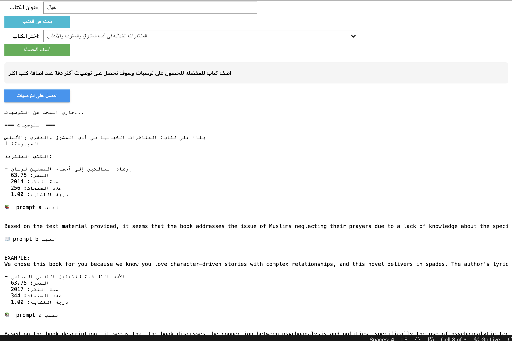

# Book Recommendation System Documentation

---

## 1. Introduction

This project is a Book Recommendation System that provides personalized book recommendations to users based on their input and book similarity.

The project was divided into multiple phases:

- Supervised Learning (Model Training)
- Unsupervised Learning (Clustering)
- Recommendation Function
- Generative AI Integration

---

## 2. Recommendation Function Explanation

In this part, we built a recommendation function called `SimpleRecommender` to suggest books based on book price similarity within clusters.

---

### Architecture Steps:

1. Load Dataset  
2. Clean & Convert Important Features  
3. Assign Clusters to Books  
4. Recommend Books based on Price Similarity  

---

### Class: `SimpleRecommender`

This class is responsible for:

- Loading the datasets.
- Converting features like `Pages`, `Publication year`, `Price` to numeric.
- Dropping missing values.
- Assigning Clusters using a simplified price binning method.
- Recommending books based on the same cluster.

---

### Key Functions:

#### `load_data()`
- Loads datasets.
- Cleans data and handles missing values.

#### `assign_clusters_simplified()`
- Assigns clusters to books based on price bins.

#### `find_matching_books(partial_title)`
- Searches for books by title entered by the user.

#### `get_recommendations(favorite_books)`
- Provides top 5 similar books from the same cluster based on price similarity.

---

## Output Example:

Below is an example of the recommendation function output.

---

### Search for Book

---
### Select Book from Dropdown

---

### Search Result

---

### Added to favourite books Output

---

### Final Recommendations Output

---
## 3. Generative AI Integration (Phase 4)

In this phase, we integrated Generative AI using zephyr-7b-beta model from Huggingface.

---

### Purpose:

- Generate Book Recommendation Explanation.
- Generate Target Audience Analysis.
- Provide Book Summary.

---

## Prompts Used:

#### Prompt A — Brief Explanation prompt 

 prompt_a = (f"Here is a book description: {description}. "
            f"The book falls under the category {category} and is similar to books in the {genre} genre. "
            "explain why it would appeal to me the same reader.")
	    
#### Prompt B — Structerd Explanation prompt 

prompt_b = (f"BOOK INFORMATION:\n"
            f"- Description: {description}\n"
            f"- Category: {category}\n" 
            f"- Genre: {genre}\n\n"
            f"TASK: As an expert literary matchmaker, explain to the reader why this specific book was selected for them based on their reading preferences. Highlight 2-3 compelling elements (characters, themes, writing style, etc.) that make this recommendation particularly suited to them.\n\n"
            f"REQUIREMENTS:\n"
            f"2. Keep your explanation brief and persuasive (3-5 sentences maximum)\n"
            f"3. Use a warm, enthusiastic tone that conveys genuine excitement about this recommendation\n"
            f"4. Begin with We chose this book for you because...\n"
            f"5. Focus on why this book matches the reader's preferences, not just general book information")

---

## Evaluation Criteria:

| Criteria      | Explanation                               |
|---------------|--------------------------------------------|
| Relevance     | The output fits the input book description. |
| Completeness  | Covers all required sections.              |
| Clarity       | Easy to understand.                        |
| Personalization | Tailored to user input.                   |

---

## Output Comparison:

### Prompt A — Brief Explanation prompt :
Below is an example output comparison of Prompt A.
Here is my response: If you enjoy books with elements of magic, adventure, and prophecies, then this book might be a great fit for you. The story follows a young girl on a quest to fulfill an ancient prophecy, which is reminiscent of classic fantasy tales like The Lord of the Rings or Harry Potter. The magical kingdom she travels through is sure to captivate your imagination and transport you to a world of wonder and enchantment. Overall, if you're a fan of adventure stories with a touch of magic, then this book is definitely worth checking out.

---

### Prompt B — Structured Explanation prompt :
 Below is an example output comparison of Prompt B.
 
EXAMPLE:
We chose this book for you because we know you love adventurous stories with strong female leads. The young girl in this fantasy novel embarks on a thrilling quest to fulfill an ancient prophecy, facing challenges and making alliances along the way. The writing style is richly descriptive, transporting you to a magical kingdom filled with wonder and danger. We think you'll be captivated by this captivating tale!

---

## Justification of Selected Prompt:

Justification of Selected Prompt:
We selected Prompt B for our system because it:

- Provides structural clarity: Prompt B creates a more organized explanation
- Emphasizes personalization: By explicitly instructing to begin with "We chose this book for you because..." it creates a more personalized feeling compared to Prompt A's more general explanation approach.
- Relevet: Prompt B's response is more specific and personalized ("we know you love adventurous stories with strong female leads") versus Prompt A's more generic approach ("if you enjoy books with elements of magic, adventure...").

---

## 4. Conclusion

By integrating Generative AI with our Recommendation System, we improved the user experience by generating detailed explanations, book summaries, and identifying target audiences.

The combination of Machine Learning techniques and Generative AI provided a powerful system capable of personalized book recommendations.

---

## End of Documentation
